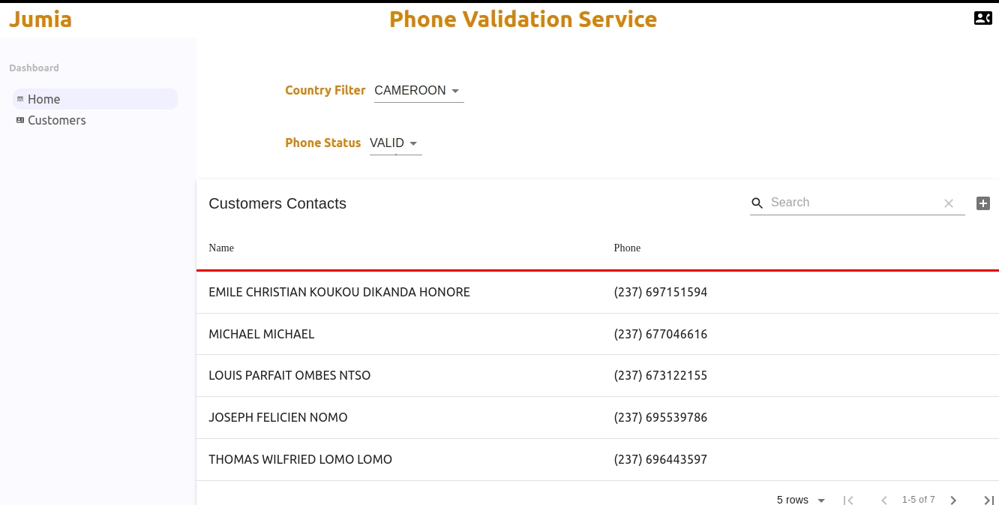

# Deployment

git clone https://github.com/SimonTemp/application.git

## Booting up Back End

cd validator-service/
  
./start.sh

## Booting up Front End

cd validator-ui-react/
  
./start.sh
http://localhost:3000/

   

